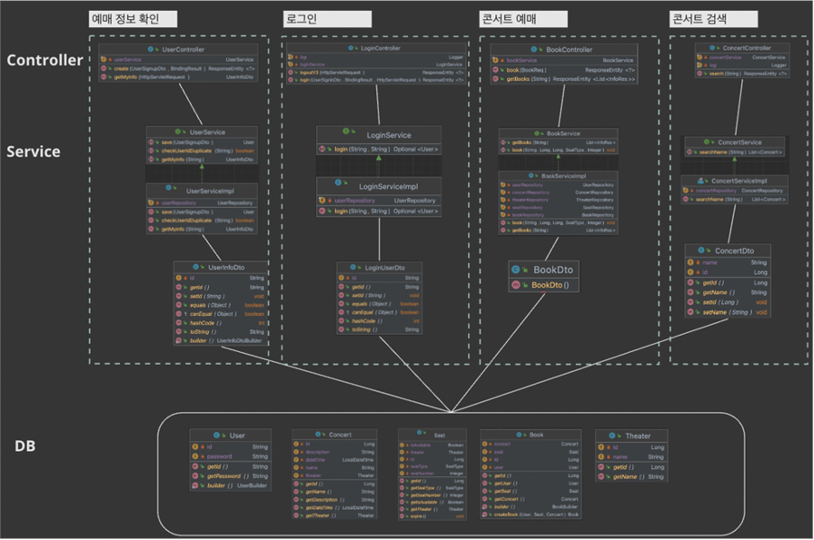
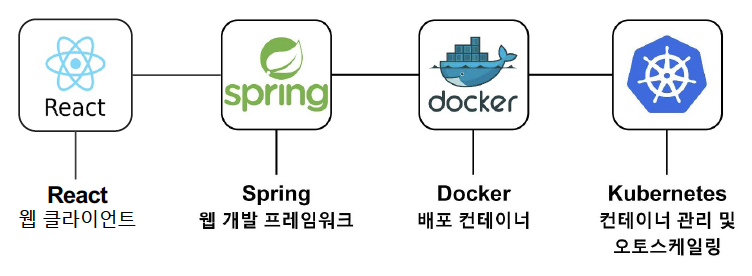
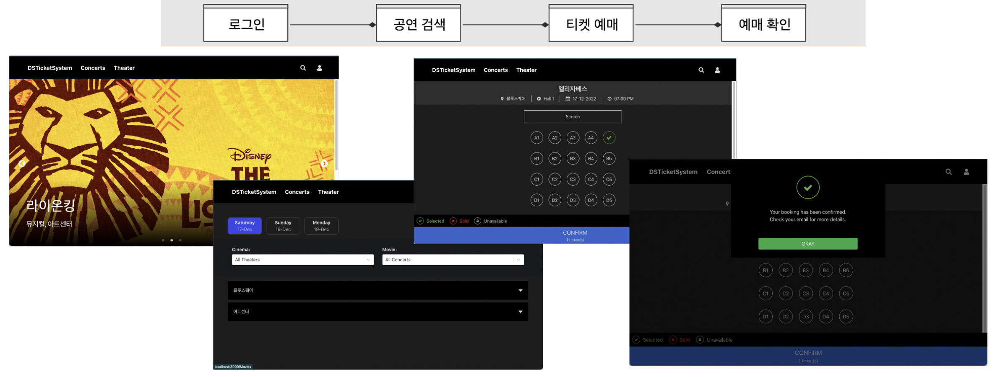
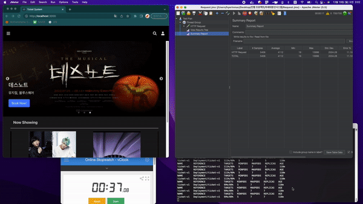

### 프로젝트 구성

---

### 문제정의

---

- 티켓 예매 시 트래픽 급증에 대비
- 트래픽 누수에 대비

### 해결방식

---

- k8s HPA를 통한 오토스케일링
- Probes를 통한 파드 서비스 상황 모니터링

### 테스트방식
---

용량성
- 150명의 사용자가 각각 공연 티켓 예매 페이지에서 티켓을 예매할 시, 서버의 CPU 사용률, 메모리 사용량 및 응답시간을 측정

- 응답시간 : 150명의 사용자가 연속으로 공연 좌석 예매 요청 시, 평균 응답시간 측정
   -> Apache JMeter 사용

- success criteria: 평균 응답시간 3초 이내
